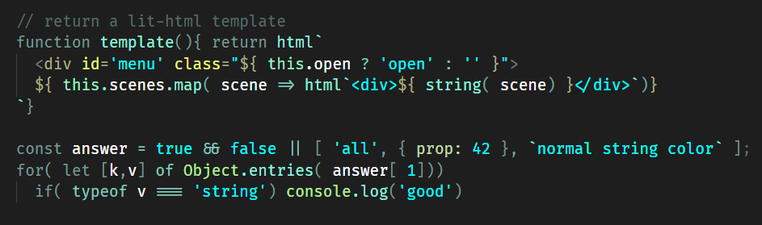
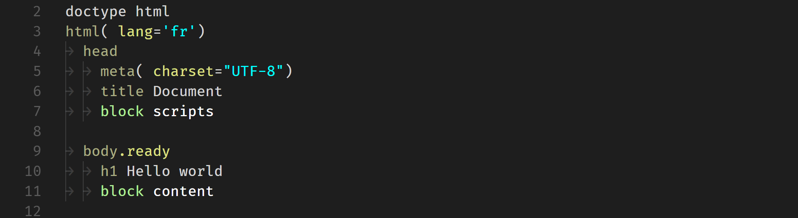

# Phœnix Dark

## Theme with a minimal color palette, focused on values 
- all value types have the same vivid color.
- colors for keywords / control characters / ponctuation etc. are muted. 
- Optimised to work with the lit-html extension (js in html in js...).

### javascript

### pug

### stylus
