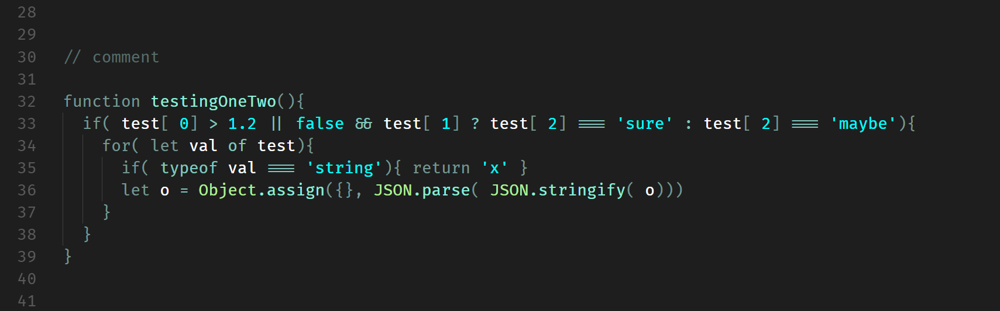
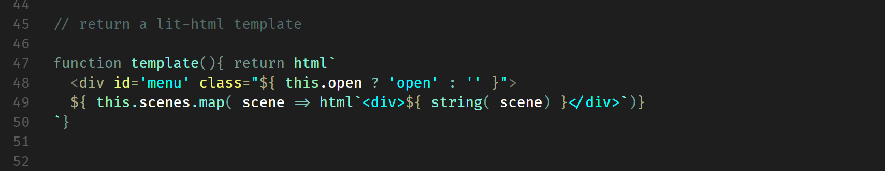

# Phœnix Dark

## VS Code theme with a minimal color palette, focused on values 

Successor of the 'simple-focus' theme, with a more uniform color palette.

- All value types have the same vivid color;
- Colors for keywords / control characters / ponctuation etc. are muted;
- Optimised to work with the lit-html extension (js in html in js...).

HTML colors are different / contrasting with JS colors so when both languages are mixed in string template literals they are clearly distinct.

### Javascript

### Javascript / HTML (lit-html)

Almost there: note the deepest div is not correctly highlighted as HTML, but as a normal string. Not sure whether this depends on lit-html extension or the language services... Hopefully this will be adressed soon!

### Pug

### Stylus

